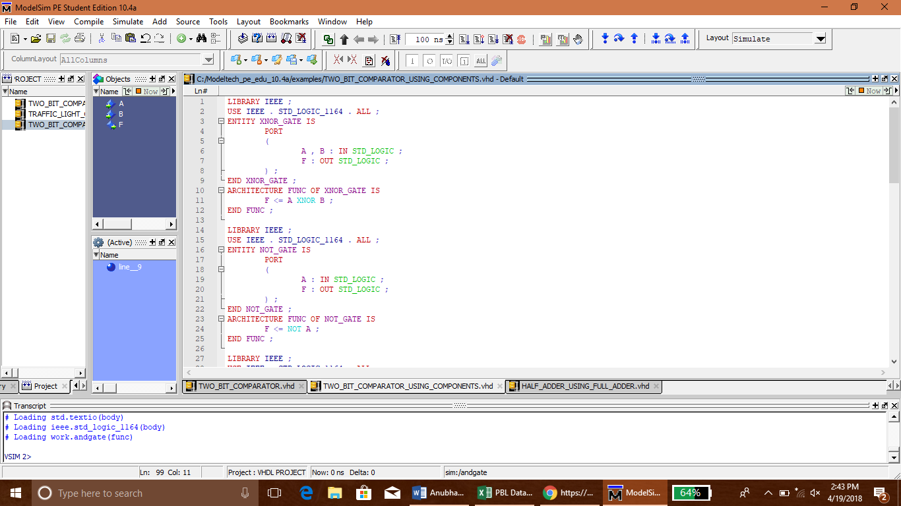

# Cryptographic-Coprocessor-Design

The project was completed as a part of Computer Architecture & Organisation course.

This repository contains the following:

1. VHDL Codes

2. PDF on allotment of projects

3. Screenshot of VHDL Code in ModelSim

4. TXT File containing the source code of the project

The team members were:

1. Ajinkya Bedekar

2. Biren Sharma

3. Dhruva Agarwal

4. Kenneth Prabakaran

A viewer needs to download the latest version of ModelSim and simulate the VHDL files through it.

Some of the useful links for VHDL:

    http://vhdl4u.blogspot.in/2010/02/vhdl-model-of-4-bit-parallel-binary.html

    https://www.scribd.com/doc/22844949/Experiment-1-Write-VHDL-Code-for-Realize-All-Logic-Gates

    http://www.fpga4student.com/2017/07/n-bit-adder-design-in-verilog.html

A screenshot of ModelSim with VHDL Code:

